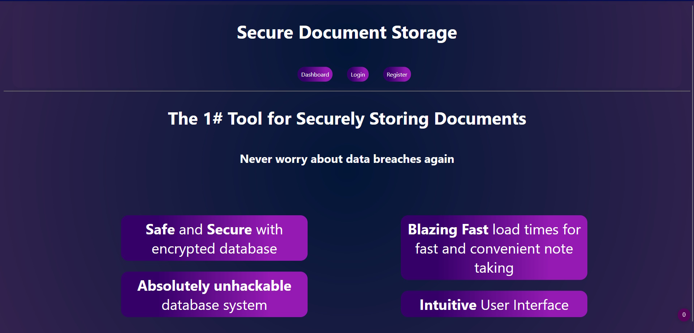
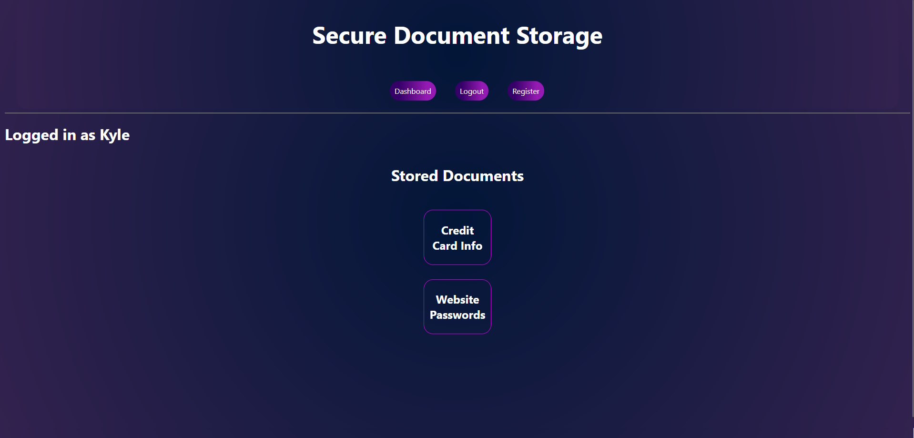

# SQL Injection Example
This was created by Ethan Posner and [Sebastien Van Den Bremt](https://github.com/Sebastien-Van). This is a simple website created using Python and the Django web framework to show how easy it is to use SQL injections when user inputs aren't sanitized. For my class at Vancouver Island University, my classmate and I gave a presentation on how this hacking technique works.

## What are SQL Injections?
SQL injections are a type of attack in which an attacker inserts malicious code into a SQL statement, in order to gain unauthorized access to a database. The attacker does this by injecting a malicious SQL query through a vulnerable web application, which then executes the malicious query on the database.

SQL injection is a serious security threat and it is important to take steps to prevent it. They are one of the most common attacks hackers use against websites. One effective way to protecte against them is by using prepared statements, which separate the SQL code from the input data, and input validation, which checks that the data entered by the user is valid and expected. By default, Django uses several security measures to protect against them.

[More information on SQL Injections](https://www.contrastsecurity.com/glossary/sql-injection).

## Usage

1. Make sure all installation instructions were followed correctly and worked without errors. It is crucial that you have all required packages installed from requirements.txt.
2. Make sure you're in the root of the project directory
    - If you're outside of the sustainablinds directory, go into it with `cd SQL-Injection-Example`
    - If you're in the django-website directory, run `cd ..`
3. Make database migrations: `src/manage.py migrate`
4. To start the website, run `src/manage.py runserver`
5. Click on the link in the terminal, or go to `http://127.0.0.1:8000/` in your browser.

At the time of writing, the following should be displayed in your browser if everything worked correctly


This website has user management, meaning users can create accounts and login to the website with them. However,
the website is purposely configured to be insecure so that SQL injections work. For example, if there is a user "Kyle" registered on the website, entering the following into the username box will bypass security: `Kyle'or 1=='1' --`

After this is done, the resulting page should be displayed:



## Installation
1. Install python [here](https://www.python.org/downloads/). Make sure it is added to your PATH environment variable. Otherwise, you won't be able to run python commands from the terminal like this: `python script.py`.
1. Navigate to project folder using `cd projects` in git bash on windows or terminal on linux
2. Run `git clone https://github.com/Enprogames/SQL-Injection-Example.git`
3. Move into project directory: `cd SQL-Injection-Example`
4. Run setup.sh script: `./setup.sh`. If this is not desired, see alternative instructions below. This does the following:
    - Creates and activates a virtual environment with venv
    - Upgrades pip to latest version and installs all packages from requirements.txt
    - Creates .env file for django secret key. You must copy your django secret key into this file.

- Alternatively, to setup the project manually and avoid running the setup.sh script, run the following (if using windows, make sure to run windows instructions inside of git bash).
    1. Create python virtual environment using venv
        - On linux: `python3 -m venv venv --prompt SQL-Injection-Example`
        - On windows: `python -m venv venv --prompt SQL-Injection-Example`
    2. Activate virtual environment
        - On linux: source venv/bin/activate
        - On windows: `source venv/Scripts/activate`
    3. Update python package manager (PIP) to latest version
        - `python -m pip install --upgrade pip`
    4. Install all required packages from requirements.txt
        - `python -m pip install -r requirements.txt`
    5. Create a .env file for the django secret key
        - ```
            cat > .env << EOF
            SECRET_KEY = 'Enter django secret key here'
            EOF
          ```
        - Ask the author for the django secret key

## License
Copyright 2022 Ethan Posner and Sebastien Van Den Bremt.

Licensed under the Apache License, Version 2.0 (the "License");
you may not use this file except in compliance with the License.
You may obtain a copy of the License at

    http://www.apache.org/licenses/LICENSE-2.0

Unless required by applicable law or agreed to in writing, software
distributed under the License is distributed on an "AS IS" BASIS,
WITHOUT WARRANTIES OR CONDITIONS OF ANY KIND, either express or implied.
See the License for the specific language governing permissions and
limitations under the License.